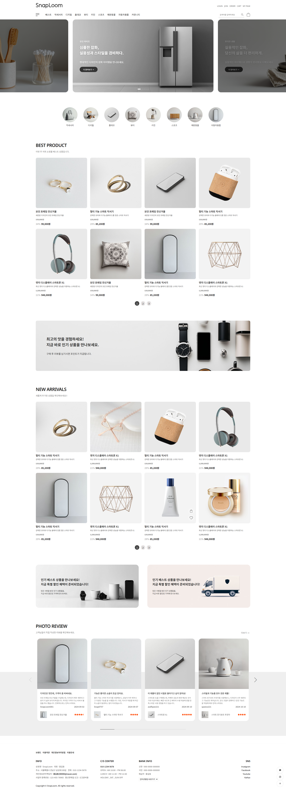

   
  

    
  

  
<h3>작업자 : 안창기</h3>
  
    
   
  
  
   

## 목차

1. **기술 스택**
2. **주요 기능**
3. **주요 페이지**
4. **페이지 설명**
5. **링크**

 

## 🛠 기술 스택

**Language**

-   
  

**Library**

- 

**Program**

- 

**ETC**

-   

 

## 💡 주요 기능

- 
- 
- 
- 

 

## 📄 주요 페이지

|                               메인 페이지                               |                               메인 페이지 - 테블릿                       |                               메인 페이지 - 모바일                       |
| :---------------------------------------------------------------------: | :---------------------------------------------------------------------:  | :---------------------------------------------------------------------:  |
|  |  |  |
 

|                               서브 페이지(1) - 메인                         |                               서브 페이지(1) - 테블릿                              |                               서브 페이지(1) -모바일                               |
| :---------------------------------------------------------------------: | :---------------------------------------------------------------------: | :---------------------------------------------------------------------: |
|  |  |  |
 

|                               서브 페이지(2) -메인                               |                               서브 페이지(2) -테블릿                               |                               서브 페이지(2) -모바일                               |
| :---------------------------------------------------------------------: | :---------------------------------------------------------------------: | :---------------------------------------------------------------------: |
|  |  |  |

 

## 📌 페이지 설명 
|                               메인 페이지                               |                               서브 페이지                               |
| :---------------------------------------------------------------------: | :---------------------------------------------------------------------: |
|        |                                           |
|                                    |                         |

 
## 📂 링크 
 
- <a href="https://www.figma.com/board/6oFqffoL10iF5YL44EXjRf/%EA%B3%B5%EA%B3%B5%EA%B8%B0%EA%B4%80-%EC%82%AC%EC%9D%B4%ED%8A%B8-%EB%A6%AC%EB%89%B4%EC%96%BC?node-id=0-1&t=iUUONf4VBQp1ZFc1-1">Demo</a>  

