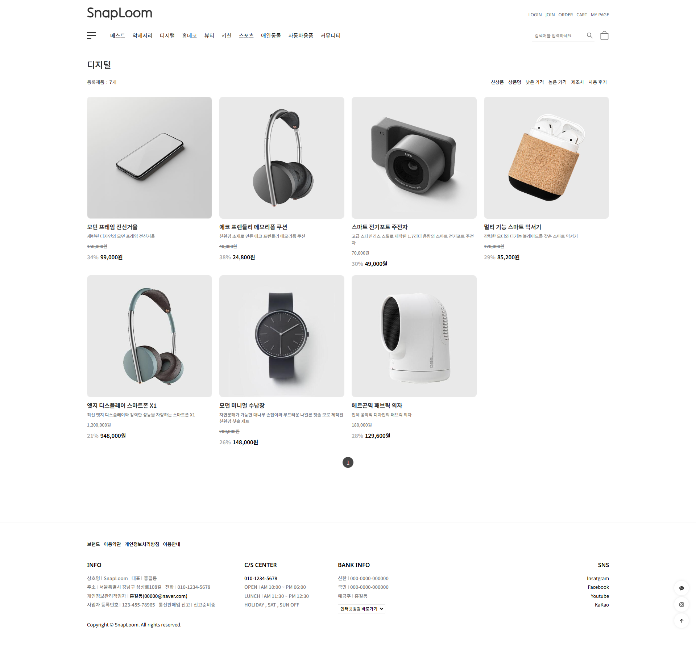
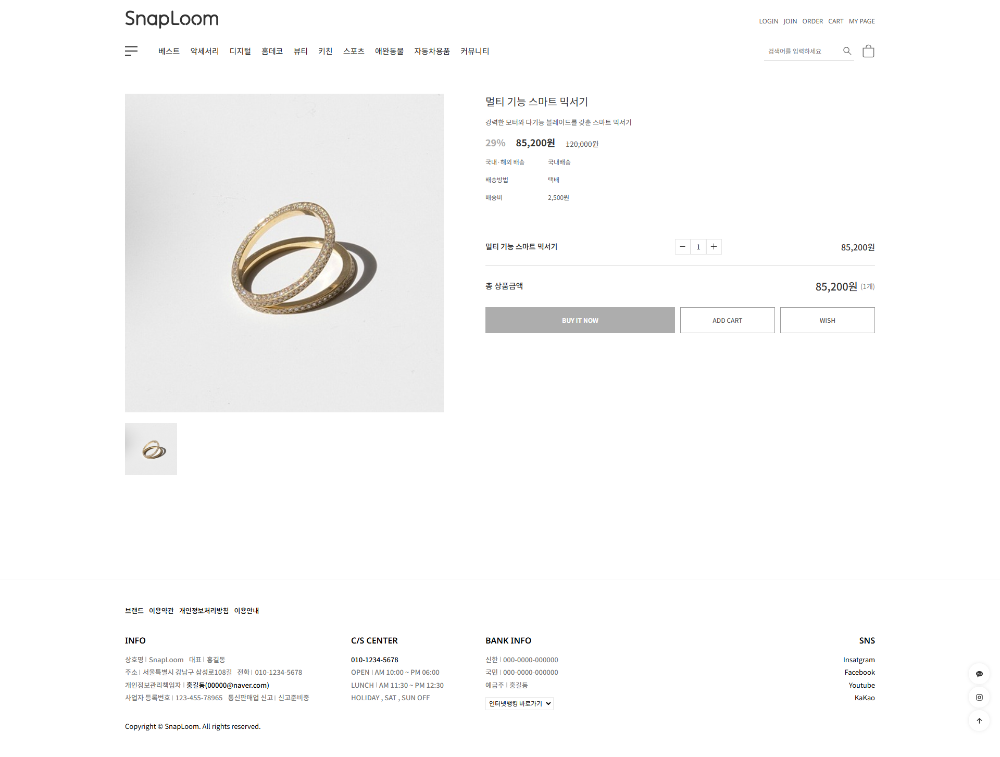
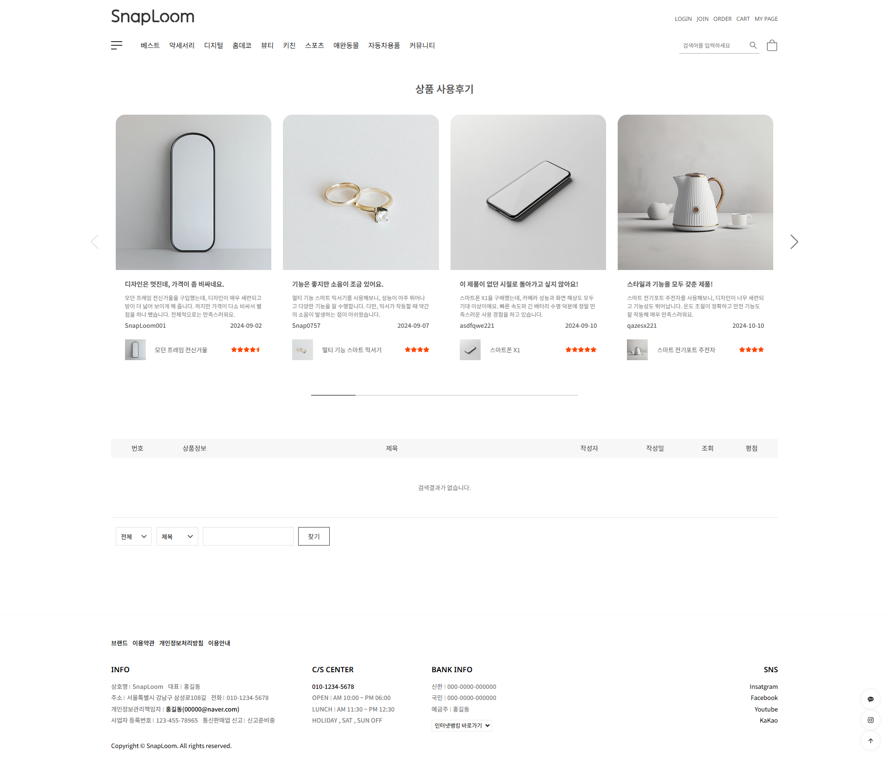
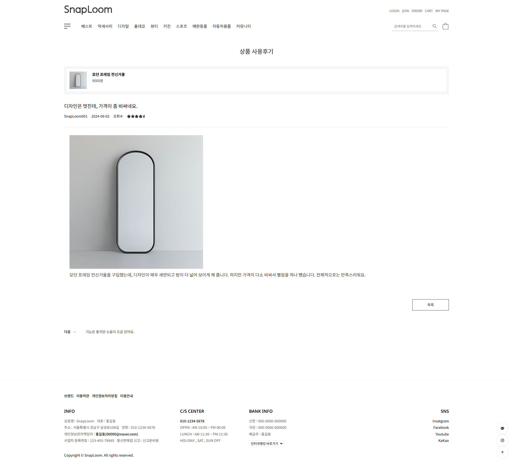
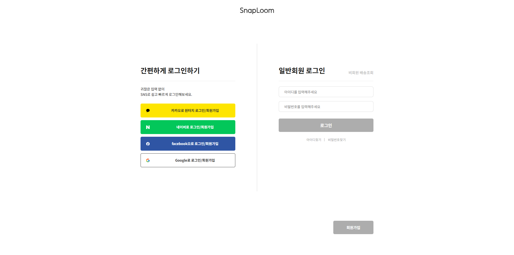
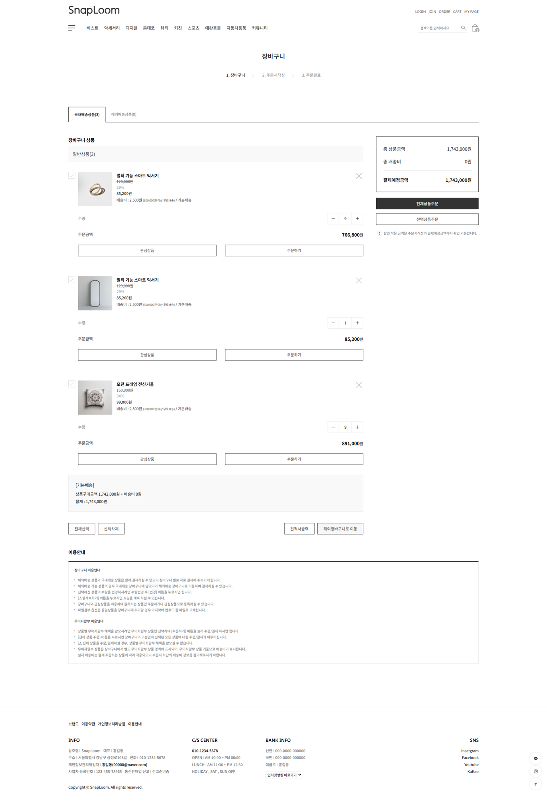

   
  

    
  

  
<h3>작업자 : 안창기</h3>
  
    
   
  
  
   

## 목차

1. **기술 스택**
2. **주요 기능**
3. **주요 페이지**
4. **페이지 설명**
5. **링크**

 

## 🛠 기술 스택

**Language**

-   
  

**Library**

- 

**Program**

- 

**ETC**

-   

 

## 💡 주요 기능

- Swiper를 이용한 슬라이더 기능
- 재사용 가능한 컴포넌트(Card, Title, Banner 등) 활용으로 코드 효율화
- 카테고리별, 베스트, 신상품 필터링
- 전역 상태 관리(CartContext)를 활용한 장바구니 상태 관리
- 장바구니 담기, 수량 직접 조절, 자동 금액 계산, 상품 삭제, 전체 선택/선택 삭제 기능
- 할인율 적용 및 무료배송 기준 계산
- 포토 리뷰 조회 및 별점 표시
- 페이지네이션 기능

 

## 📄 주요 페이지

|                               메인 페이지                               |                  서브 페이지 - 카테고리 페이지                   |                               서브 페이지 - 상품 상세 페이지                       |                               서브 페이지 - 포토리뷰 페이지                       
| :---------------------------------------------------------------------: | :---------------------------------------------------------------------:  | :---------------------------------------------------------------------:  | :---------------------------------------------------------------------:  |
|  |  |  |  |
 

|                               서브 페이지 - 포토리뷰 상세 페이지                       |                               서브 페이지 - 로그인 페이지                      |                               서브 페이지 - 장바구니 페이지                     |
| :---------------------------------------------------------------------: | :---------------------------------------------------------------------:  | :---------------------------------------------------------------------:  |
|  |  |  |
 

## 📌 페이지 설명 
|                               페이지                               |                               설명                               |
| :----------------------------------------------------------------: | :--------------------------------------------------------------: |
|    메인 페이지                                                      |           베스트 및 신규 상품 필터링, 슬라이더, 페이지네이션을 구현하였으며 상품 호버 시 즉시 장바구니 담기가 가능한 퀵 버튼을 제공합니다.                                                       |
|    카테고리 페이지                                                      |        카테고리별 세분화된 필터링 기능을 통해 사용자가 원하는 조건의 상품을 최적화된 동선으로 탐색할 수 있도록 구현했습니다.                                                          |
|    상품 상세 페이지                                                      |        구매 희망 수량을 자유롭게 조절하고 이를 실시간으로 장바구니에 반영할 수 있는 인터랙션을 구현했습니다.                                                          |
|    포토리뷰 페이지                                                      |         슬라이더 UI를 적용하여 시각적으로 풍부한 포토 리뷰 콘텐츠를 한눈에 확인할 수 있도록 구성했습니다.                                                         |
|    포토리뷰 상세 페이지                                                      |       이전 및 다음 리뷰로 바로 이동할 수 있는 내비게이션 기능을 통해 끊김 없는 리뷰 탐색 환경을 제공합니다.                                                           |
|    로그인 페이지                                                      |              탭(Tab) 메뉴 구성을 통한 직관적인 로그인 인터페이스를 구현햇습니다                                             |
|    장바구니 페이지                                                      |            장바구니의 상품 삭제 및 개별/전체선택 기능을 비롯해 수량 변경 시 합계 금액이 즉시 갱신되는 자동 계산 로직을 적용했습니다.                                                       |
 

## 📂 링크 
 
- <a href="https://changgi-react-shoppingmall.netlify.app/">Demo</a>  

