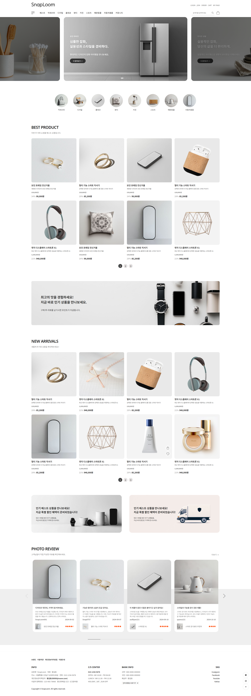
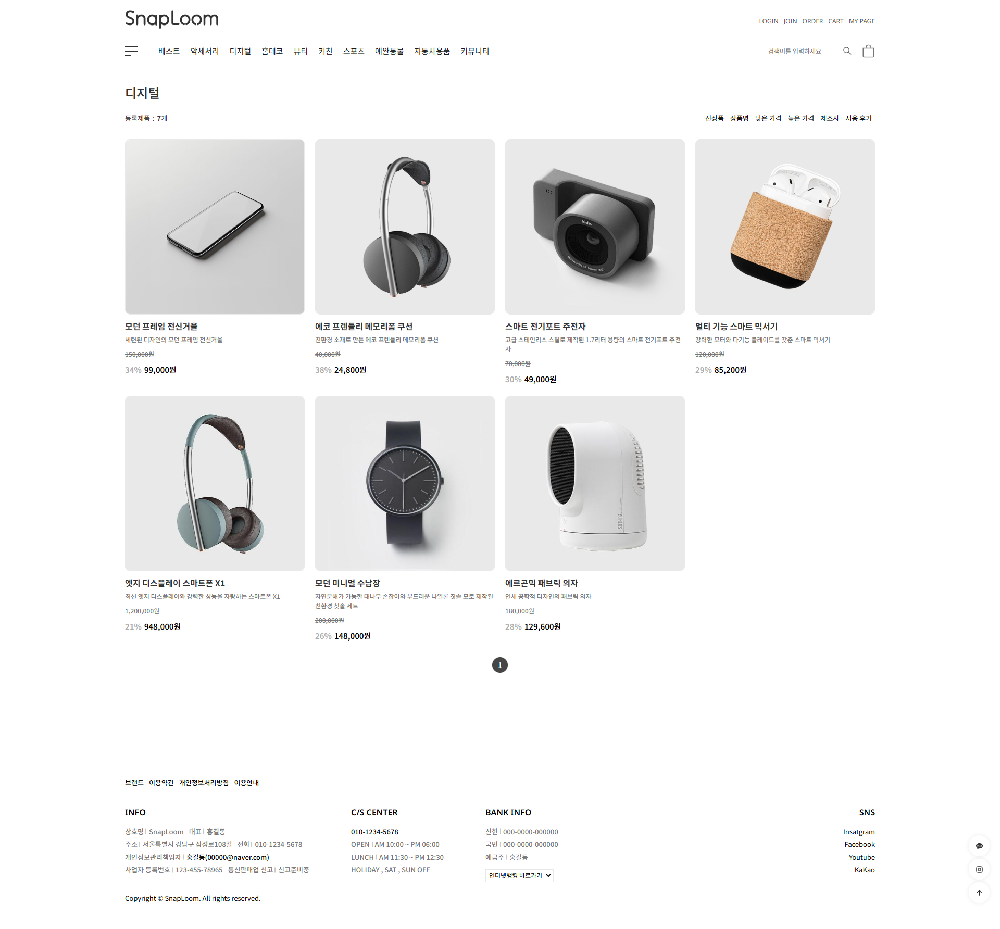
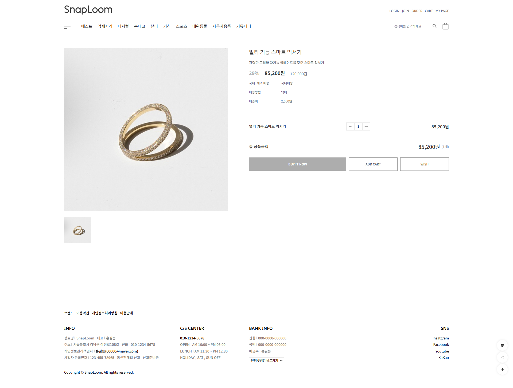
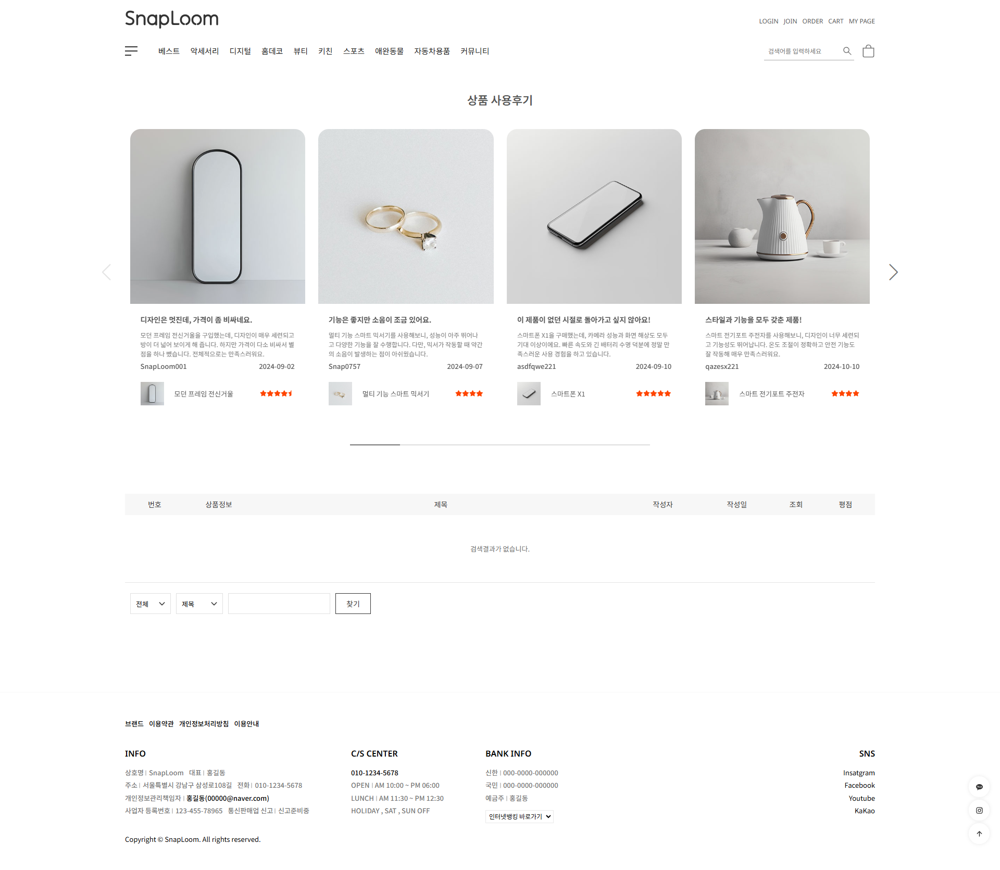
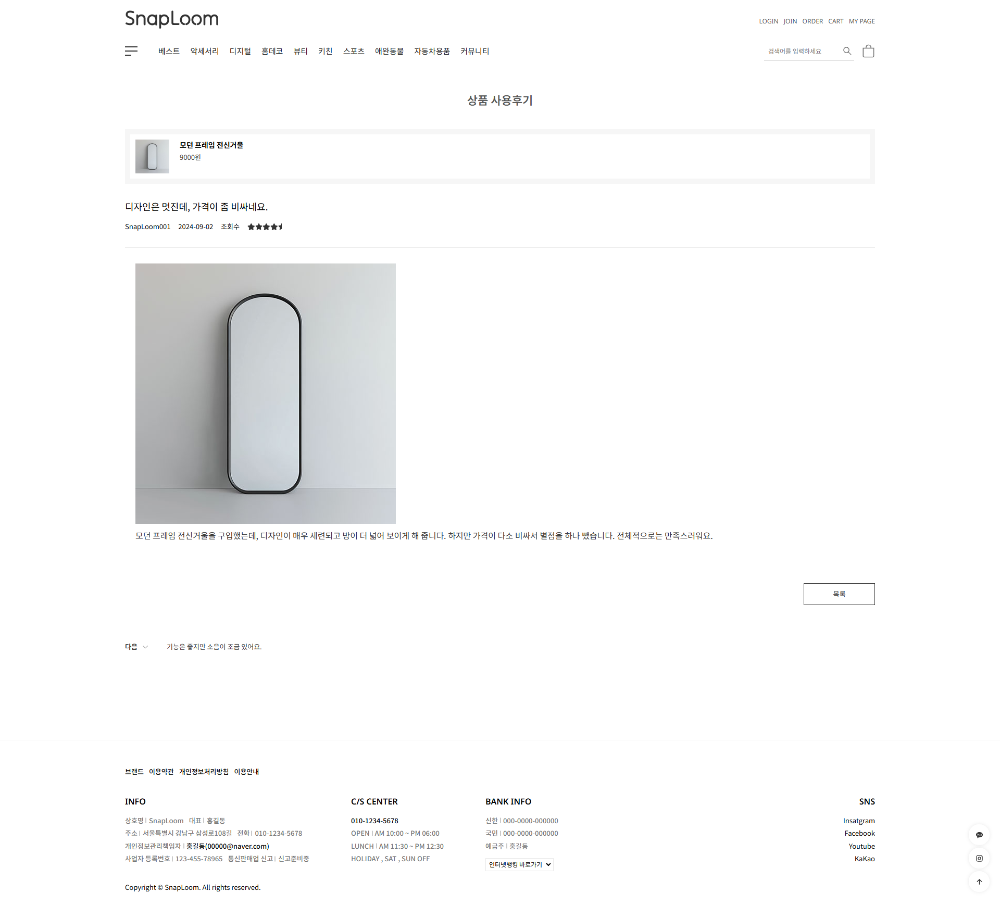
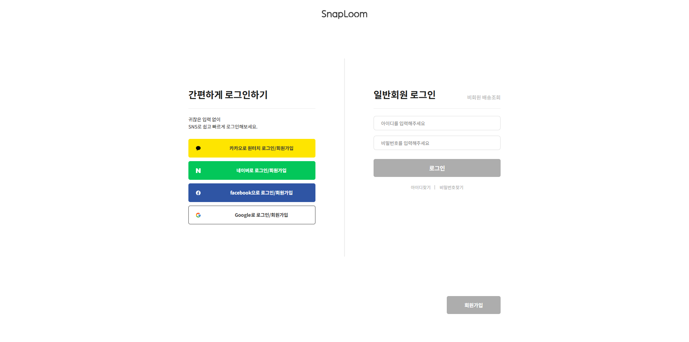

   
  

    
  

  
<h3>작업자 : 안창기</h3>
  
    
   
  
  
   

## 목차

1. **기술 스택**
2. **주요 기능**
3. **주요 페이지**
4. **페이지 설명**
5. **링크**

 

## 🛠 기술 스택

**Language**

-   
  

**Library**

- 

**Program**

- 

**ETC**

-   

 

## 💡 주요 기능

- 카테고리 페이지 : 카테고리별로 상품을 추출하여 해당 카테고리에 속한 상품만 출력
- 상품 상세 페이지 : 상품의 수량을 직접 입력하거나 버튼으로 증가/감소시킬 수 있으며, 수량에 따라 가격이 실시간으로 조정되고, 조정된 수량과 가격을 반영하여 상품을 장바구니에 담을 수 있음
- 포토리뷰 상세 페이지 : "이전" 및 "다음" 버튼을 통해 다른 리뷰로 이동 및 "목록" 버튼을 클릭하면 포토리뷰 페이지로 이동
- 상품 카드 : 상품 카드에 표시된 장바구니 아이콘을 클릭하면 해당 상품이 장바구니에 추가
- 장바구니 페이지 : 장바구니에 담긴 상품의 수량을 직접 조정할 수 있으며, 조정된 수량에 따라 합산 금액이 자동으로 계산됨 그리고 잘못 추가된 상품은 체크박스를 선택 후 삭제할 수 있음(현재(25.01.21) 구현 진행중)

 

## 📄 주요 페이지

|                               메인 페이지                               |                  서브 페이지 - 카테고리 페이지                   |                               서브 페이지 - 상품 상세 페이지                      |
| :---------------------------------------------------------------------: | :---------------------------------------------------------------------:  | :---------------------------------------------------------------------:  |
|  |  |  |
 

|                               서브 페이지 - 포토리뷰 페이지                       |                               서브 페이지 - 포토리뷰 상세 페이지                       |                               서브 페이지 - 로그인 페이지                      |                               서브 페이지 - 장바구니 페이지                       |
| :---------------------------------------------------------------------:  | :---------------------------------------------------------------------:  | :---------------------------------------------------------------------:  | :---------------------------------------------------------------------:  |
|  |  |  |  |
 

 
## 📂 링크 
 
- <a href="http://changgi-react-shoppingmall.netlify.app">Demo</a>  

